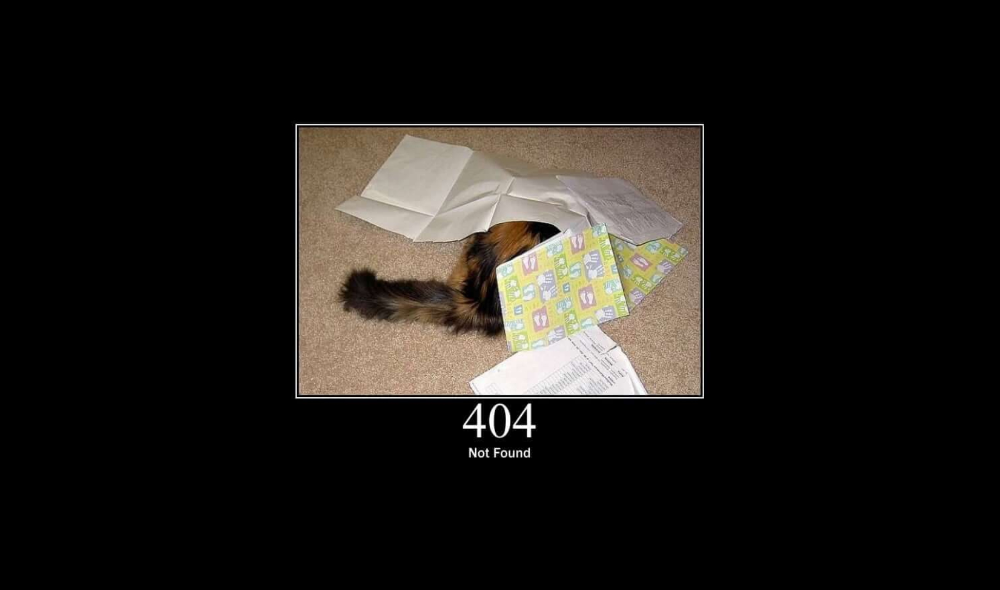

# Http::Cat::Rails

http-cat-rails is a configurable gem that changes every http-error page in your rails application with an image of a cute
little cat, that describes ~purrfectly~ the error code (credits for the default images to https://http.cat)



## Configuration

To change this gem's behaviour, you can create a http_cat_rails.rb inside /config/initializers, and structure it as
follows:

```ruby
Http::Cat::Rails.configure do |c|
  c.base_url = "https://http.dog/"
  c.status_codes = { "404": "code_name", "500": "code_name_2" }
end
```

In this example we told our gem to show dog images, but only for error codes 404 and 500

## Installation

Add this line to your application's Gemfile:

```ruby
gem "http-cat-rails"
```

And then execute:

```bash
$ bundle
```

Or install it yourself as:

```bash
$ gem install http-cat-rails
```

Then, you'll need to add this line to your application.rb:

```ruby
config.exceptions_app = self.routes
```

## Troubleshooting

This gem won't work if your application.rb or <your_environment>.rb contains the following line

```ruby
config.consider_all_requests_local = true
```

## Contributing

It's a small project, but if you want to contribute feel free to send a Pull Request, or open an Issue

## License
The gem is available as open source under the terms of the [MIT License](https://opensource.org/licenses/MIT).
